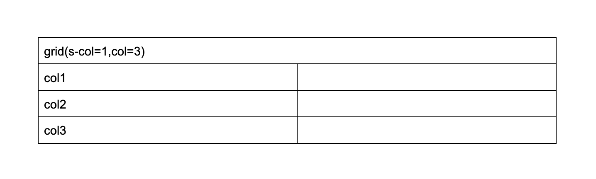

# Eddy's Custom Element

Plugin to allow decorate block as webcomponent / custom element

## Installation

Having a forked project from https://github.com/adobe/aem-boilerplate

You can use by just

`npm i @netcentric/eddys-custom-element`

it will install the scripts at the root of your Edge delivery project under `libs/`

## Usage

A Regular block

```javascript
export default function decorate(block) {
  // your logic
}
```

As custom element and classes for extensablility and lifecicles

```javascript
import curryDecorator from '../../libs/curry-decorate/curry-decorate.js';

export class Hero extends HTMLElement {
  connectedCallback() {
    // rendering is done then call onComponentComplete for showing
    if (this.onComponentComplete) this.onComponentComplete(this);
  }
}
// define a custom element name and constructor
export default curryDecorator('raqn-hero', Hero);
```

That way you can create and extend components as classes and web components

```javascript
import curryDecorator from '../../libs/curry-decorate/curry-decorate.js';

export class Stage extends Hero {
  connectedCallback() {
    // your logic
    // call super for on complete or skip and call it
    super.connectedCallback();
  }
}
export default curryDecorator('raqn-stage', Stage);
```

### Shadow Dom Component

```javascript
import curryDecorator from '../../libs/curry-decorate/curry-decorate.js';
import ShadowDomComponent from '../../libs/shadow-dom-component/shadow-dom-component.js';

export class ShadowExample extends ShadowDomComponent {
  connectedCallback() {
    // your logic
    // call super for on complete or skip and call it
    super.connectedCallback();
  }
}
export default curryDecorator('raqn-shadow-example', Stage);
```

Extending that class will create a custom element with shadow dom where:

1. Regular css should be used for avoiding CLS
2. Inject a \*.shadow.css of the component into the shadow dom

```html
<head>
  <!-- Regular Edge Delivery Block CSS -->
  <link
    rel="stylesheet"
    href="/blocks/your-custom-element/your-custom-element.css"
  />
</head>
<your-custom-element>
  ~ #shadow-root (open) == $0
  <!-- Add a *.shadow.css into the shadow dom -->
  <link
    rel="stylesheet"
    href="/blocks/your-custom-element/your-custom-element.shadow.css"
  />
</your-custom-element>
```

### Custom Params Component

This allow the usage of attributes as class params in edge delivery

1. Allow passing params from classes defined in Edge Delivery Services
2. Allow sending params per breakpoint
3. Convert classes into element attributes for usage as web components attributes.

Let's check this content for example:



Here we have a block called grid, and there's 2 params defined

1. `s-col` with represents a col attribute in S breakpoint
2. `col` with represents all other breakpoints param

Then we want our block to be a web component and receibe params

1. we import the customElementsDecorate to create a custom element
2. We extend CustomParamsComponent class to inherit attributes assignment

```javascript
import customElementsDecorate from '../../libs/custom-element-decorate/custom-element-decorate.js';
import { CustomParamsComponent } from '../../libs/custom-params-component/custom-params-component.js';

export class Grid extends CustomParamsComponent {
  ...
}
// create custom element
export default customElementsDecorate('eddys-grid', Grid);
```

So now our block will look like this:

```html
<eddys-grid class="grid s-col-1 col-3 block" col="3"></eddys-grid>
```

If you go to the S breakpoint it will look like

```html
<eddys-grid class="grid s-col-1 col-3 block" col="1"></eddys-grid>
```

Now that we setup the component let's create proper Web component feature

- We use params to setup a grid.
- We update the grid based on the param change.

Let's enhance our component as a simple example

```javascript
import customElementsDecorate from '../../libs/custom-element-decorate/custom-element-decorate.js';
import { CustomParamsComponent } from '../../libs/custom-params-component/custom-params-component.js';

export class Grid extends CustomParamsComponent {
  // observe changes in the col attribute
  static get observedAttributes() {
    return ['col'];
  }

  // inicialize on connectedCallback
  connectedCallback() {
    // call the super for attribute setting
    super.connectedCallback();
    // setup grid variables
    this.setupGrid();
    // show component when complete
    if (this.onComponentComplete) this.onComponentComplete(this);
  }

  // update variables and styles if col attribute is set
  setupGrid() {
    const cols = this.getAttribute('col');
    if (!cols) {
      return;
    }
    this.cols = parseInt(cols, 10);
    this.area = Array.from(Array(this.cols))
      .map(() => '1fr')
      .join(' ');
    this.style.setProperty('--grid-template-columns', this.area);
  }

  // update grid if attribute is changed
  attributeChangedCallback(name, oldValue, newValue) {
    if (name === 'col' && oldValue !== newValue) this.setupGrid();
  }
}
// create custom element
export default customElementsDecorate('eddys-grid', Grid);
```

### Breakpoints

Breakpoints can be overriden by `window.eddysBreakpoints` global
```javascript
window.eddysBreakpoints = {
  s: 0,
  m: 600,
  l: 900,
  xl: 1200,
  xxl: 1500,
};
```

### Docs

- LICENSE
- docs/CODE_OF_CONDUCT.md
- docs/CONTRIBUTING.md
- docs/CHANGELOG.md --> dynamically updated

### Issue template

- .github/ISSUE_TEMPLATE.md

### PR template

- .github/PULL_REQUEST_TEMPLATE.md --> automatically closes connected issue

### Workflows

- CI --> npm ci, test and build
- CodeQL --> Perform CodeQL Analysis (Security, etc.)
- Release --> semantic-release:
  - Creates release notes
  - Updates CHANGELOG
  - Updates package.json version
  - Creates Git tag/release
  - Publish package to NPM
- Manual Release --> same as Release, but can be triggered manually in Actions tab

### Release

- based on Angular Commit Message Conventions in commits -
  https://github.com/angular/angular/blob/master/CONTRIBUTING.md#commit-message-header
- Commit message format is used to build:
  - Release notes
  - Changelog updates
  - NPM package semver

### Commit message Convention

```
<type>(<scope>): <short summary>
│       │             │
│       │             └─⫸ Summary in present tense. Not capitalized. No period at the end.
│       │
│       └─⫸ Commit Scope (optional): project|based|list
│
└─⫸ Commit Type: build|ci|docs|feat|fix|perf|refactor|test
```
